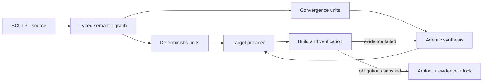

# SCULPT Convergent Programming Concept

(C) 2026 byte5 GmbH

Status: strategic foundation for the next SCULPT architecture. This document
describes the intended language category and compiler model. It is not a claim
that every described capability already exists in the current compiler.

## 1. Core Thesis

**SCULPT is a programming language for programming solution spaces.**

Classical source code describes one implementation. Prompts describe wishes in
prose. A SCULPT program defines:

- what must remain true,
- what AI is allowed to decide,
- which valid solutions are preferred,
- how correctness must be demonstrated,
- which generated decisions are retained.

AI is not an assistant attached to the language. It is a semantic part of the
compiler. Developers do not manage an agent through conversation; they program
the bounded space in which compiler agents may work.

This language category is called **Convergent Programming**.

## 2. Product Promise

SCULPT must combine properties that prompt-first and agent-first development do
not currently provide as one coherent programming system:

| Prompt-first development | SCULPT |
|---|---|
| Prose and conversation history | Versioned source code |
| Implicit expectations | Explicit constraints and freedoms |
| Agent-owned work strategy | Compiler-controlled convergence |
| Tests added around generated code | Evidence obligations inside the program |
| Context that drifts or disappears | Persistent semantic project memory |
| Broad regeneration | Incremental recompilation of affected units |
| Output accepted by inspection | Classified evidence for every critical requirement |
| Advantage for skilled prompters | Advantage for skilled software developers |

SCULPT restores the value of decomposition, types, interfaces, state models,
invariants, refactoring, tests, and architecture without returning to fully
manual implementation.

## 3. Language Model

SCULPT has three first-class semantic layers.

| Layer | Responsibility |
|---|---|
| Deterministic core | Data, types, calculations, states, rules, and effects whose behavior is precisely defined. |
| Convergence units | Typed regions whose implementation is synthesized inside an explicit solution space. |
| Capability contracts | Discoverable and verifiable abilities supplied by target providers and libraries. |

### 3.1 Convergence Units

The current `nd/propose/satisfy` experiment should evolve into a clearer
language construct, provisionally called `shape`.

```sculpt
module(Operations.IncidentDesk):
  use(web.ui)
  use(security.rbac)
  use(quality.accessibility)

  flow(Triage):
    start > Open

    state(Open):
      ui.show(IncidentView)
      on resolve(note) > Resolved
    end

    state(Resolved):
      emit incidentResolved
    end
  end

  shape(IncidentView) -> ui.View:
    require ui.shows(id, severity, owner, timeline)
    require security.permits(resolve, roles(Lead, Admin))
    require accessibility.level(AA)

    prefer ui.density(compact)
    allow layout, typography, microcopy

    verify scenario(resolveCriticalIncident)
  end
end
```

This is conceptual syntax, not yet the normative grammar.

A convergence unit has typed inputs and outputs and may contain:

| Construct | Meaning |
|---|---|
| `require` | A mandatory obligation that must be supported by evidence. |
| `prefer` | An optimization goal that may not violate mandatory obligations. |
| `allow` | An explicit degree of freedom granted to compiler agents. |
| `verify` | A scenario, property, test, or validator used as acceptance evidence. |
| `example` | A positive example that narrows intended behavior. |
| `reject` | A negative example that excludes an unwanted solution class. |

No symbol may be unexplained magic. It must come from SCULPT core, an imported
module, a provider contract, or an explicit local definition.

### 3.2 Prose Escape Hatch

Free-form natural language may remain available as an explicit escape hatch,
but it must be treated like inline assembly in a conventional high-level
language:

- isolated and visible,
- intentionally non-portable,
- assigned weak evidence by default,
- reported separately by compiler diagnostics,
- never allowed to become the hidden primary language.

The current `?"..."` experiment is a possible surface form. Its final syntax
must be decided by the language specification, not by implementation accident.

### 3.3 Compile-Time Versus Runtime Freedom

SCULPT convergence is primarily compile-time non-determinism. It does not imply
random or unstable runtime behavior. A generated implementation may be fully
deterministic after a successful build.

## 4. Progressive Formalization

The defining development workflow is **progressive formalization**:

1. A developer starts with a deliberately broad solution space.
2. SCULPT generates and verifies a working candidate.
3. The compiler exposes the decisions made during synthesis.
4. The developer accepts, rejects, constrains, or locks individual decisions.
5. The solution space becomes narrower without rewriting the application in a
   different language.
6. Only affected convergence units are synthesized again.
7. Critical areas can become almost fully deterministic while low-risk areas
   remain open.

A short SCULPT program can therefore express a broad family of acceptable
programs. A much longer SCULPT program can express nearly one acceptable
implementation. Both remain valid forms of the same language.

A future `sculpt refine` workflow should be able to convert selected decisions
from an accepted build into proposed source-level constraints. This turns
iteration into literal sculpting instead of prompt accumulation.

## 5. Compiler Architecture



### 5.1 Compilation Pipeline

1. Parse SCULPT source into a typed semantic graph.
2. Resolve modules, contracts, capabilities, effects, and target requirements.
3. Partition deterministic and convergent units.
4. Select only the affected graph slices and relevant contract fragments.
5. Let compiler agents plan and synthesize provider-specific implementation.
6. Build, test, inspect, and repair through provider-owned tools.
7. Accept output only when all mandatory obligations have sufficient evidence.
8. Produce executable artifacts, generated source, provenance, evidence, and a
   granular lock.

### 5.2 Agentic Compilation

Modern models should not be used as one-shot IR generators. A compiler agent
must be able to:

- inspect the relevant semantic graph,
- request provider documentation and capabilities,
- generate or patch implementation units,
- invoke builds and tests,
- interpret diagnostics,
- repair failures,
- stop only when the convergence policy is satisfied or a precise failure is
  reported.

The user-facing interface remains `sculpt build` and `sculpt run`. Agent
conversation is an internal compiler mechanism, not the development language.

### 5.3 Incremental Context

Large context windows do not remove the need for compiler architecture. SCULPT
must never depend on sending an entire large project on every build.

The semantic graph must provide:

- dependency and impact analysis,
- semantic hashes per unit,
- cached contract fragments,
- cached accepted implementation units,
- invalidation of only affected units,
- model-independent project memory.

Context is a build resource, like CPU time and memory, and must be budgeted and
observable.

## 6. Evidence Instead Of Pretend Determinism

Not every software requirement can be mathematically proven. SCULPT must never
pretend that all constraints have equal certainty.

| Evidence class | Examples |
|---|---|
| Static | Type check, schema, contract, effect rule, or invariant. |
| Executable | Unit test, scenario, property test, benchmark, or successful build. |
| Evaluated | Independent model evaluation against explicit criteria. |
| Human | Explicit approval by an authorized reviewer. |
| Unverified | An assumption without sufficient evidence. |

Every mandatory obligation records its evidence class. Project and release
policies may require minimum evidence levels. Security, financial integrity, or
data correctness rules must not silently pass on model judgment alone.

A successful SCULPT build therefore produces an evidence graph, not merely a
green process exit.

## 7. Output And Provenance

Generated target code is inspectable build output, not the primary source of
truth. Changes should normally be made in SCULPT source or accepted through a
refinement operation.

Every accepted build should contain:

- executable or deployable artifacts,
- generated target source,
- a semantic build report,
- satisfied, weak, and unresolved obligations,
- source-to-output traceability,
- model, provider, contract, toolchain, and input versions,
- token, latency, and cost telemetry,
- a granular lock for exact replay or selective regeneration.

Semantic diffing must show not only which generated lines changed, but which
intent, constraint, capability, or evidence caused the change.

## 8. Target And Provider Model

A single universal UI-oriented Target IR cannot scale to every framework,
runtime, device, or future platform. It would become either a lowest common
denominator or an unmaintainable world model.

The replacement is a hybrid lowering model:

- SCULPT owns the universal semantic graph.
- Target providers publish capabilities, types, constraints, tools, templates,
  validators, build steps, run descriptors, and packaging rules.
- A provider chooses whether synthesis emits target source or a
  provider-specific intermediate representation.
- The compiler owns convergence, evidence, provenance, policy, and caching.
- Target-specific facets can specialize a shared domain core without polluting
  that core with platform details.

This keeps SCULPT universal at the semantic level while allowing providers to
use the real strengths of their platforms.

## 9. Team-Scale Programming

For professional projects, the semantic graph must support:

- typed modules and domain namespaces,
- explicit imports and exports,
- project and workspace files,
- ownership and criticality metadata,
- contract versioning,
- impact analysis and safe rename operations,
- parallel compilation of independent units,
- merge-safe source and lock structures,
- IDE navigation, completion, diagnostics, and semantic refactoring.

The compiler, not prompt history, becomes the durable shared memory of the
team.

## 10. What To Keep, Change, And Replace

| Existing direction | Decision |
|---|---|
| Rust compiler, parser, AST, CLI, and TUI | Keep as engineering foundation. |
| Modules, namespaces, scopes, and project files | Keep and complete. |
| Capability contracts and provider separation | Keep as a core principle. |
| High-ND versus low-ND programming | Promote into the central language model. |
| Compact IR | Rework into an incremental typed semantic graph. |
| Freeze and replay | Expand from whole-build locking to granular decisions and units. |
| `nd/propose/satisfy` | Replace with clearer convergence semantics. |
| Universal generic Target IR | Replace with semantic IR plus provider-specific lowering. |
| One-shot LLM generation | Replace with an agentic compile-build-test-repair loop. |
| Compiler-owned mappings for every framework | Replace with provider-owned tools and contracts. |
| Immediate expansion to many targets | Pause until one reference provider proves the model. |

## 11. Ten-Year Relevance

SCULPT must not compete with model intelligence. Better models should make
SCULPT compilation more capable, cheaper, and more reliable without making the
language obsolete.

The durable value of SCULPT is:

- formal structure,
- composition and reuse,
- typed boundaries,
- explicit freedom,
- verifiable obligations,
- incremental project knowledge,
- refactoring and team workflows,
- provider and model independence.

The syntax is not the moat. The semantic graph, convergence process, evidence
system, and accumulated project decisions are.

## 12. Focused Validation Plan

| Phase | Required outcome |
|---|---|
| 1. Language kernel | Normative definition of convergence units, freedom, constraints, and evidence. |
| 2. Convergence compiler | Agentic compile-test-repair loop over an incremental semantic graph. |
| 3. Reference provider | One production-capable web provider rather than several shallow targets. |
| 4. Reference application | A professional business application in high-freedom and low-freedom SCULPT forms. |
| 5. Honest benchmark | SCULPT versus modern agentic coding using the same model, requirements, tests, and time budget. |
| 6. Platform expansion | Additional targets only after a clear benchmark win. |

The reference application should include persistent data, roles, validation,
workflow, audit history, responsive UI, and automated acceptance scenarios.

## 13. Success And Stop Criteria

SCULPT must demonstrate material advantages over direct agentic coding in most
of these dimensions:

- accepted change lead time,
- regression rate,
- reproducibility across regeneration,
- review and comprehension time,
- semantic source size and maintainability,
- cross-model portability,
- incremental build cost,
- traceability from requirement to implementation and evidence.

If the same model, repository, and test suite perform equally well without the
SCULPT semantic layer, SCULPT is only an alternative prompt notation and does
not have sufficient reason to exist.

If SCULPT source remains the stable, understandable, and verifiable truth of an
AI-generated software system, it represents a genuine new programming language
category.

## 14. Canonical Elevator Pitch

> **Prompts tell AI what you want. SCULPT lets you program what AI is allowed
> to build.**
>
> SCULPT is the convergent programming language for the AI era. Developers
> encode behavior, constraints, freedoms, and proof as versioned source code;
> compiler agents generate and refine the implementation until every required
> obligation is satisfied.
>
> It gives professional developers the speed of AI generation without
> surrendering software architecture to prose, conversation history, and luck.
