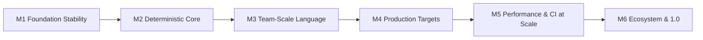

# SCULPT Roadmap

(C) 2026 byte5 GmbH

## Vision Target

**SCULPT must become the default coding interface for AI-era development teams:**  
more controllable than vibe coding, more expressive than rigid templates, and more reproducible than prompt-only workflows.

---

## Milestone Path

```mermaid
flowchart LR
  M1["M1 Foundation Stability"] --> M2["M2 Deterministic Core"]
  M2 --> M3["M3 Team-Scale Language"]
  M3 --> M4["M4 Production Targets"]
  M4 --> M5["M5 Performance & CI at Scale"]
  M5 --> M6["M6 Ecosystem & 1.0"]
```

---

## Milestones (Outcome-Driven)

| Milestone | Strategic Goal | Exit Criteria |
|---|---|---|
| **M1 Foundation Stability** | Make current compiler behavior predictable for daily use. | Parser/semantics stable across examples, TUI/CLI workflow reliable, artifacts isolated per script, no blocking known regressions. |
| **M2 Deterministic Core** | Enforce contract-driven behavior where it matters. | Target functions/constants validated pre-LLM, strict ND policy with explicit soft constraints, deterministic replay path trusted in CI. |
| **M3 Team-Scale Language** | Enable large codebases and multi-dev collaboration. | Module imports, namespace refactoring safety, scoped rules inside states/flows, project-level structure for 100+ files. |
| **M4 Production Targets** | Deliver credible cross-platform outputs, not demos. | `gui` parity on macOS/Windows/Linux, meaningful `web` app output, target provider contract extensions documented and testable. |
| **M5 Performance & CI at Scale** | Keep large projects fast and affordable. | Incremental compile slices, compact IR pipeline default, token budgets and cost telemetry, cache/reuse of unchanged units. |
| **M6 Ecosystem & 1.0** | Open ecosystem without losing quality. | Versioned provider SDK, contract compatibility checks, curated provider registry process, publish-ready 1.0 language/compiler spec. |

---

## Execution Waves

| Wave | Priority | Focus |
|---|---|---|
| **Now** | Highest | M1 + M2 |
| **Next** | High | M3 + M4 |
| **Then** | High | M5 |
| **Release Track** | Medium | M6 |

---

## Next Milestones (Execution Order)

| Step | Milestone | Scope (Concrete) | Exit Criteria |
|---|---|---|---|
| **1** | **A. Data-Path Safety Completion** | ND guardrails for critical data rules, stronger diagnostics for data/signature/schema failures, strict artifact enforcement defaults. | Data-heavy benchmark passes matrix + reproducibility gate without manual fixes; failures are explicit and actionable. |
| **2** | **B. Contract + Namespace Scalability** | Contract versioning + compatibility checks, larger namespace/import workflows, explicit symbol cataloging per target package. | Large multi-module projects compile with clear dependency diagnostics and no magic symbol ambiguity. |
| **3** | **C. Provider Platform Hardening** | Stable provider interfaces (LLM + target), retry/fallback policies, provider telemetry normalized in build metadata and TUI. | External providers can plug in with predictable behavior and pass contract validation test suites. |
| **4** | **D. Production-Grade Target Outputs** | `gui` parity across macOS/Windows/Linux, stronger `web` stack adapters (SSR/CSR profiles), deterministic build artifacts per target. | Non-demo app scenarios run across platforms with target-specific quality gates passing in CI. |
| **5** | **E. Competitive Benchmark Release Gates** | Standard benchmark suite (workflow, data-heavy, UI) as release gate; SCULPT-vs-vibe deltas tracked by version. | Release candidate blocked unless SCULPT meets pre-registered pass thresholds on benchmark matrix. |

---

## North-Star Metrics

| Dimension | 1.0 Direction |
|---|---|
| **Developer Control** | Lower failure rate vs prompt-first vibe coding on same tasks. |
| **Reproducibility** | Same input + lock + provider version => same build output class. |
| **Team Scalability** | Large projects remain navigable and merge-safe. |
| **Target Portability** | Same SCULPT source can compile through multiple target providers with predictable constraints. |
| **Economics** | Token/cost/latency become first-class compile metrics with optimization knobs. |

---

## Non-Negotiables

- Keep SCULPT code-first, not prose-first.
- Keep AI flexibility explicit and controllable.
- Keep deterministic paths available for CI and release workflows.
- Keep target/provider ecosystem open, but contract-validated.
